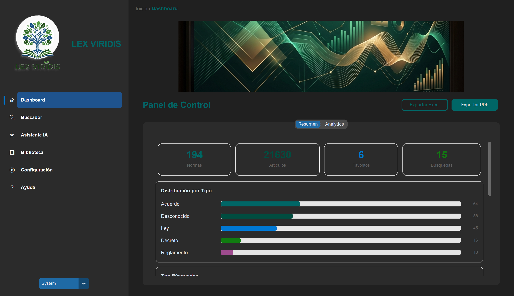
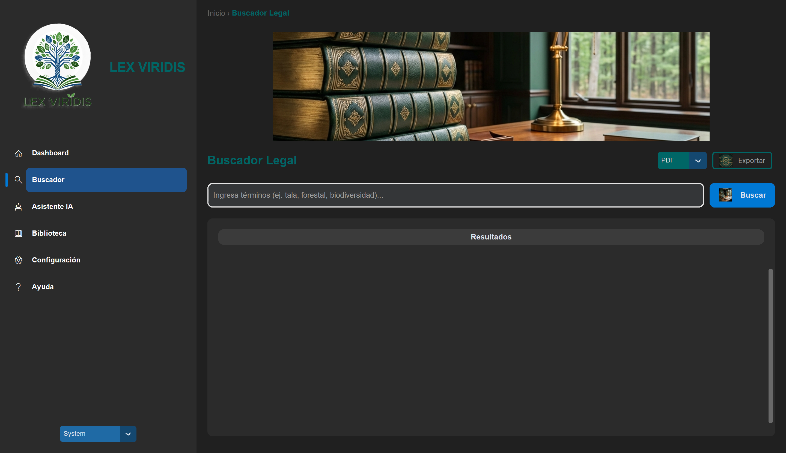
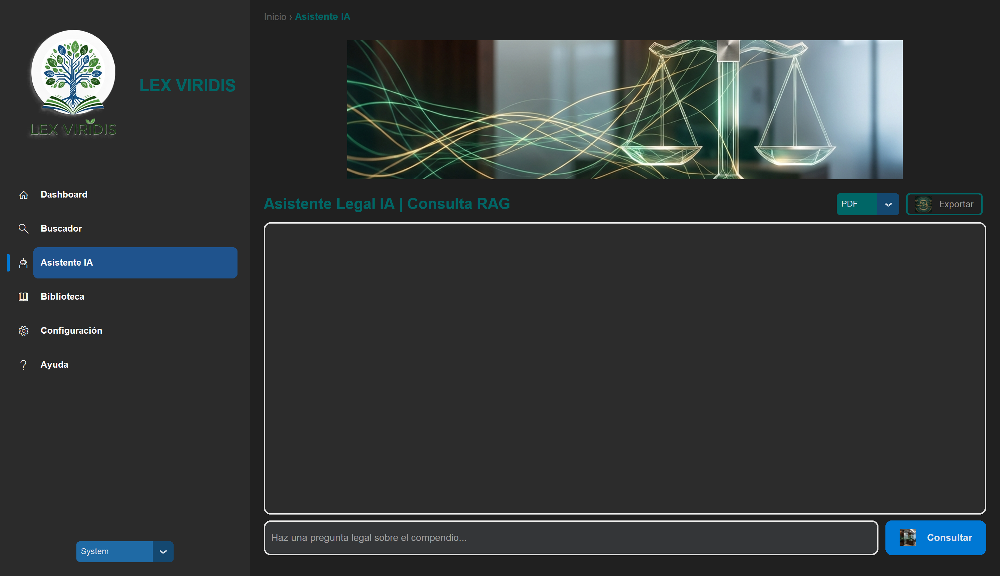
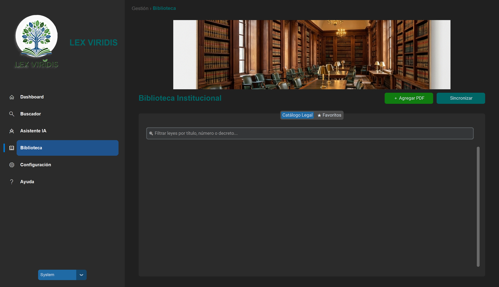

# 🌿 LEX VIRIDIS — Compendio Legal Ambiental de Honduras

Sistema de búsqueda inteligente para normativa ambiental hondureña con IA integrada.
**v3.2.0.2026** | Sistema de Gestión Legal Institucional

---

## 📸 Capturas de Pantalla

| Dashboard | Buscador Legal |
|:---------:|:--------------:|
|  |  |

| Asistente IA | Biblioteca |
|:------------:|:----------:|
|  |  |

---

## 🚀 Inicio Rápido

```bash
# Activar entorno virtual
.venv\Scripts\activate

# Ejecutar aplicación
python main.py
```

---

## ✨ Características

- 🔍 **Búsqueda Híbrida**: Motor FTS5 + sinónimos legales + búsqueda semántica asistida por IA.
- 🤖 **Asistente IA**: RAG (Retrieval-Augmented Generation) con Google Gemini y Groq/Llama.
- 📄 **Visor PDF**: Acceso directo a los documentos oficiales desde los resultados.
- 📊 **185+ Documentos**: Leyes, decretos, reglamentos y acuerdos ambientales de Honduras.
- 📚 **Biblioteca Legal**: Navegación y búsqueda dentro del compendio completo de leyes.
- 🎨 **UI Windows 11**: Diseñada con CustomTkinter, tema claro/oscuro y sidebar animado.
- 🔐 **Sistema de Licencias**: Acceso controlado por institución con autenticación de usuarios.

---

## 💼 Casos de Uso — Contexto Institucional / Honduras

**Caso 1: Fiscal en Campo**
> Un fiscal necesita verificar las sanciones aplicables por deforestación ilegal durante una inspección en sitio.
> Con LEX VIRIDIS, consulta la Ley Forestal en segundos desde su laptop, **sin depender de internet**.

**Caso 2: Analista Técnico**
> Un técnico ambiental necesita comparar disposiciones entre el Código Penal y la Ley General del Ambiente para un informe.
> El Asistente IA extrae y contrasta los artículos relevantes de ambas normas en una sola consulta.

**Caso 3: Formación Profesional**
> Un técnico nuevo en la institución necesita conocer la normativa ambiental hondureña.
> El compendio de 185+ documentos indexados funciona como base de conocimiento estructurada para capacitación.

---

## 📁 Estructura del Proyecto

```
LEX_VIRIDIS_APP/
├── 📁 lexviridis/               # Módulo principal
│   ├── 📁 views/                # Vistas: Dashboard, Buscador, IA, Biblioteca, etc.
│   ├── config.py                # Configuración centralizada
│   ├── search_engine.py         # Motor FTS5 con sinónimos y búsqueda híbrida
│   ├── ai_assistant.py          # RAG: Gemini / Groq con contexto legal
│   └── design_system_ctk.py     # Sistema de diseño (colores, tipografía, assets)
│
├── 📁 LEX_VIRIDIS_DB/           # Base de datos SQLite (legislacion_ambiental.db)
├── 📁 LEX_VIRIDIS_LICENCIA/     # Sistema de licenciamiento institucional
├── 📁 COMPENDIO LEYES FEMA/     # PDFs oficiales (185+ documentos)
├── 📁 assets/                   # Iconos, imágenes, capturas de pantalla
├── 📁 data/                     # Configuración y sesión de usuario
│
├── main.py                      # ⭐ Punto de entrada
├── requirements.txt             # Dependencias Python
└── README.md
```

---

## 🔧 Requisitos

- Python 3.11+
- Windows 10 / 11

## 📦 Instalación

```bash
# Crear entorno virtual
python -m venv .venv

# Activar
.venv\Scripts\activate

# Instalar dependencias
pip install -r requirements.txt

# Ejecutar
python main.py
```

---

## 🗺️ Hoja de Ruta

| Versión | Funcionalidad planificada |
|---------|--------------------------|
| v3.3 | Búsqueda semántica con embeddings locales (sin internet) |
| v4.0 | App móvil Android para consultas en campo |
| v4.1 | Sincronización en la nube del compendio entre instituciones |
| v5.0 | Panel web institucional multi-usuario |

---

## 📞 Soporte Técnico

**ING. FERNANDO R. ARDON RODRIGUEZ**  
**EMAIL**: [frardonr@hotmail.com](mailto:frardonr@hotmail.com)

## 👥 Créditos y Colaboración

Este proyecto es el resultado de una colaboración técnica avanzada:

*   **Dirección y Gestión Técnica:** Ing. Fernando R. Ardon Rodriguez.
*   **Asistentes de IA y Desarrollo:** Antigravity (Advanced Agentic Coding), Google Gemini y Claude Opus 4.6.
*   **Ilustraciones y Arte Visual:** Nano Banana AI.

---

**Versión**: 3.2.0.2026 | **Plataforma**: Windows 10/11 | **Última actualización**: Marzo 2026
