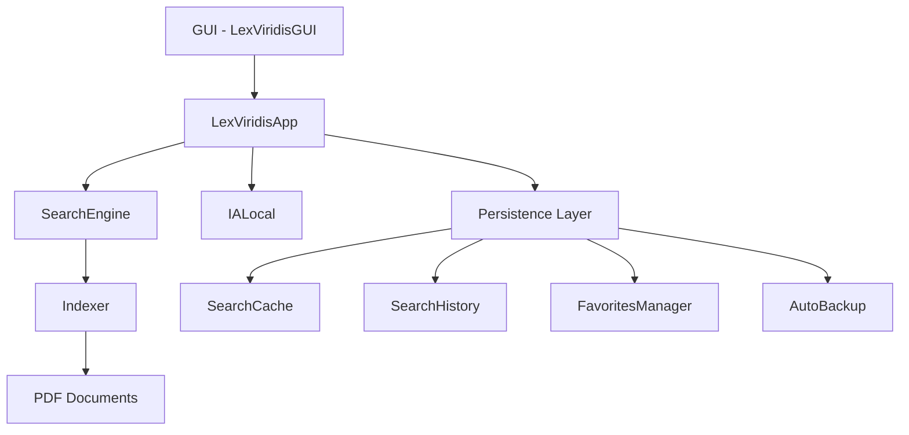

# LEX VIRIDIS - Sistema Integrado de Búsqueda Jurídica Ambiental

## Descripción General

LEX VIRIDIS es un sistema completo de búsqueda y análisis de documentos legales ambientales de Honduras, que integra inteligencia artificial local con técnicas avanzadas de indexación y recuperación de información.

## Arquitectura del Sistema

El sistema está compuesto por los siguientes módulos integrados:

### 1. **Módulo Principal** (`app.py`)
- **LexViridisApp**: Clase principal que coordina todos los componentes
- Gestiona la interacción entre GUI, motor de búsqueda, IA y persistencia
- Punto de entrada para la lógica de negocio

### 2. **Configuración** (`config.py`)
- Configuración centralizada de rutas, versiones y parámetros
- Sistema de logging unificado
- Gestión de directorios y archivos de datos

### 3. **Interfaz Gráfica** (`gui.py`)
- **LexViridisGUI**: Interfaz de usuario completa en tkinter
- Sistema de temas (claro/oscuro)
- Componentes reutilizables y responsivos

### 4. **Inteligencia Artificial Local** (`ia_local.py`)
- **IALocal**: Integración con modelos de IA local via Ollama
- Funciones especializadas:
  - `preguntar()`: Consultas al modelo
  - `resumen()`: Resúmenes de documentos
  - `explicacion_clara()`: Explicaciones en lenguaje sencillo

### 5. **Indexador de Documentos** (`indexer.py`)
- **Indexer**: Indexación y gestión de documentos PDF
- Sistema de caché inteligente
- Actualización incremental de índices
- Validación de archivos PDF

### 6. **Motor de Búsqueda** (`search_engine.py`)
- **SearchEngine**: Motor de búsqueda de texto completo
- Búsqueda por términos múltiples
- Contexto de resultados
- Optimización de rendimiento

### 7. **Persistencia de Datos** (`persistence.py`)
- **SearchCache**: Caché de búsquedas
- **SearchHistory**: Historial de búsquedas
- **FavoritesManager**: Gestión de favoritos
- **AutoBackup**: Respaldos automáticos

### 8. **Utilidades** (`utils.py`)
- Funciones auxiliares y helpers
- Normalización de texto
- Validación de PDFs
- Optimización de memoria
- Apertura de archivos con visor nativo

## Flujo de Integración



## Uso del Sistema Integrado

### Instalación y Configuración

1. **Requisitos previos**:
   ```bash
   pip install -r requirements.txt
   ```

2. **Instalación de Ollama** (para IA local):
   ```bash
   curl -fsSL https://ollama.ai/install.sh | sh
   ollama pull mistral
   ```

3. **Ejecutar el sistema**:
   ```bash
   python -m lexviridis.main
   ```

### API de Integración

```python
from lexviridis import LexViridisApp, IALocal, Indexer, SearchEngine

# Inicializar componentes
app = LexViridisApp(root)  # tk.Tk()
ia = IALocal(model="mistral")
indexer = Indexer()
engine = SearchEngine(text_index)

# Flujo típico
indexer.load_or_create_index()
results = engine.search(["ley ambiental"])
summary = ia.resumen(results[0]['context'])
```

## Estructura de Directorios

```
lexviridis/
├── __init__.py          # Paquete Python
├── app.py              # Aplicación principal
├── config.py           # Configuración
├── gui.py              # Interfaz gráfica
├── ia_local.py         # IA local
├── indexer.py          # Indexador
├── search_engine.py    # Motor de búsqueda
├── persistence.py      # Persistencia
├── utils.py            # Utilidades
├── test_integration.py # Tests de integración
├── README.md          # Este archivo
└── main.py            # Punto de entrada
```

## Características de Integración

### 1. **Cohesión de Módulos**
- Todos los módulos están diseñados para trabajar juntos
- Interfaces bien definidas entre componentes
- Manejo consistente de errores y logging

### 2. **Escalabilidad**
- Arquitectura modular permite agregar nuevos componentes
- Sistema de plugins potencial para extensiones
- Configuración centralizada para fácil mantenimiento

### 3. **Rendimiento**
- Caché inteligente de búsquedas
- Indexación incremental
- Optimización de memoria
- Procesamiento asíncrono donde sea posible

### 4. **Testing**
- Suite de tests de integración completa
- Mocks para dependencias externas
- Verificación de flujo completo del sistema

## Ejemplos de Uso

### Búsqueda Completa
```python
from lexviridis import LexViridisApp, SearchEngine, IALocal

# Inicializar sistema
app = LexViridisApp(root)
engine = SearchEngine(app.indexador.text_index)
ia = IALocal()

# Realizar búsqueda
results = engine.search(["protección ambiental", "recursos forestales"])

# Analizar resultados con IA
for result in results[:3]:
    summary = ia.resumen(result['context'])
    print(f"Resumen: {summary}")
```

### Gestión de Datos
```python
from lexviridis.persistence import SearchHistory, FavoritesManager

# Guardar búsqueda
history = SearchHistory()
history.add(["ley forestal", "conservación"])

# Marcar favorito
favorites = FavoritesManager()
favorites.add("/path/to/document.pdf", "Ley forestal importante")
```

## Solución de Problemas

### Errores Comunes

1. **Ollama no encontrado**:
   - Verificar instalación: `which ollama`
   - Instalar modelo: `ollama pull mistral`

2. **PDF no indexado**:
   - Verificar que el archivo existe
   - Validar formato PDF con `PDFValidator`

3. **Problemas de permisos**:
   - Verificar permisos de escritura en directorios de datos
   - Usar `chmod` o ajustar configuración de rutas

## Contribución

Para contribuir al sistema integrado:

1. Fork el repositorio
2. Crear feature branch
3. Asegurar que todos los tests pasan
4. Documentar nuevas integraciones
5. Submit pull request

## Licencia

Este sistema integrado es parte del proyecto LEX VIRIDIS.
